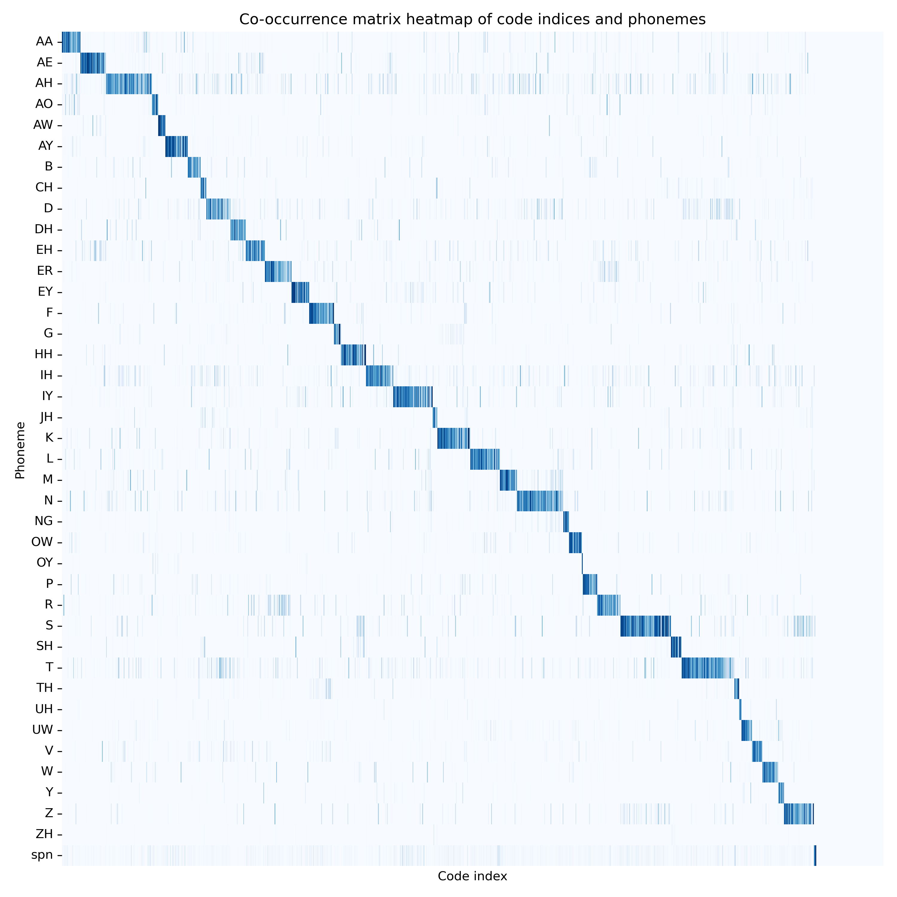
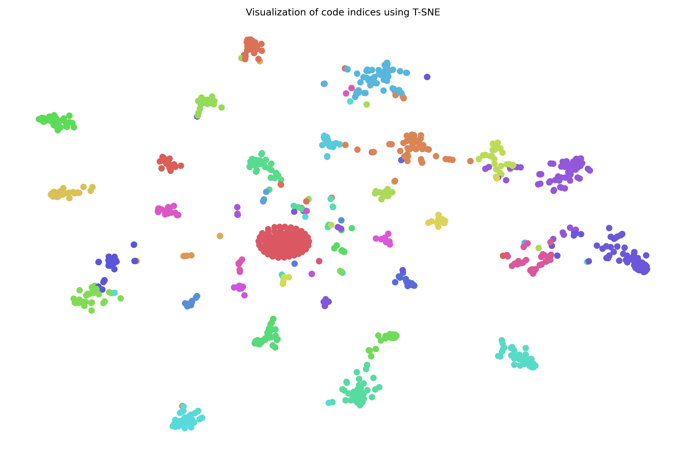

# Phoneme and Codec Token Visualization

*Created by Zixiang Wan, 2025*

## Purpose

Visualize the relationships between phonemes and codec tokens in a specialized speech dataset.

## Dataset

[LJSpeech Dataset](https://keithito.com/LJ-Speech-Dataset/)

## Preprocessing

Use [Montreal Forced Aligner (MFA)](https://montreal-forced-aligner.readthedocs.io/en/latest/) to obtain phoneme timestamps.

## Visualization

- Co-occurrence heatmap
- t-SNE visualization

## Usage

### 1. Download and Unzip the LJSpeech Dataset

```bash
wget https://data.keithito.com/data/speech/LJSpeech-1.1.tar.bz2
tar -xjfv LJSpeech-1.1.tar.bz2
```

### 2. Install Montreal Forced Aligner (Approximately 5-10 Minutes)

```bash
conda install -c conda-forge montreal-forced-aligner
```

*Note: This step may take a while.*

### 3. Obtain Phoneme Timestamps Using MFA

#### 3.1 Resample WAV Files to 16kHz

*MFA only supports 16kHz audio.*

```bash
mkdir -p LJSpeech-1.1/wavs_16k

for file in LJSpeech-1.1/wavs/*.wav; do
    base=$(basename "$file")
    sox "$file" -r 16000 "LJSpeech-1.1/wavs_16k/$base"
done
```

#### 3.2 Prepare `.lab` Files for MFA

```bash
python prepare_files_for_MFA.py
```

#### 3.3 Download the English Acoustic Model and Dictionary

```bash
mfa model download acoustic english_us_arpa
mfa model download dictionary english_us_arpa
```

*Optional: Check available models.*

```bash
mfa model list acoustic
mfa model list dictionary
```

More details about MFA commands can be found in the [MFA User Guide](https://montreal-forced-aligner.readthedocs.io/en/latest/user_guide/workflows/alignment.html#api-reference).

Details about MFA models and dictionaries can be found in the [MFA Models Documentation](https://mfa-models.readthedocs.io/en/latest/acoustic/English/English%20(US)%20ARPA%20acoustic%20model%20v3_0_0.html).

#### 3.4 Run MFA for Alignment (Approximately 20 Minutes)

```bash
mfa align LJSpeech-1.1/wavs_16k english_us_arpa english_us_arpa textgrids
```

After alignment is completed, the output folder `textgrids` will contain TextGrid files corresponding to the audio files. These files contain phoneme-level timestamp information.

### 4. Generate Co-occurrence Heatmap and t-SNE Visualization

```bash
python draw.py
```

## Results

Below are examples of the code execution results:

<p align="center">
  
  
</p>
